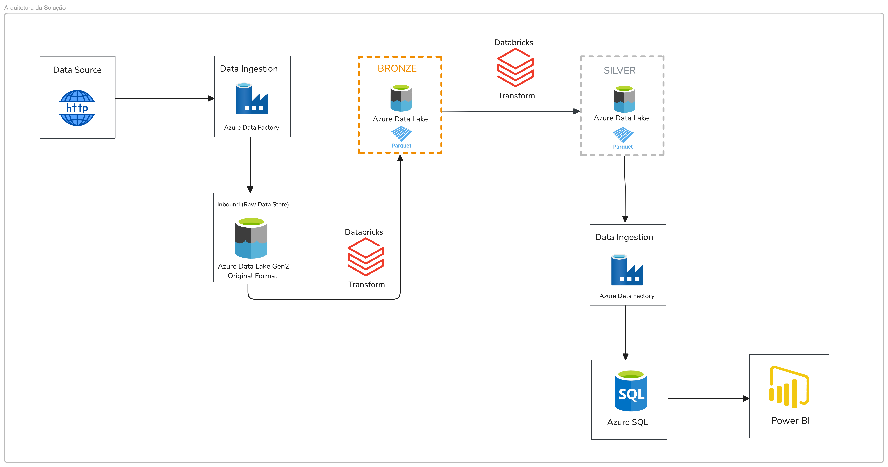
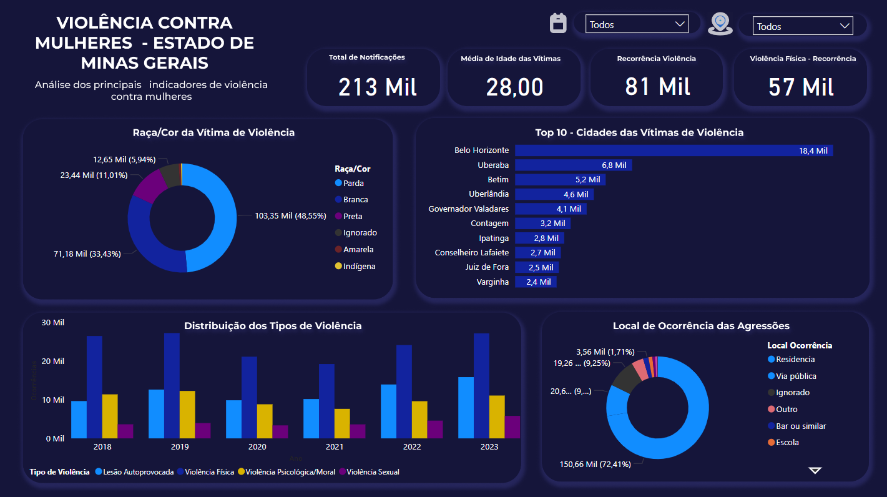

# Projeto Engenharia de Dados End to End: Azure Data Factory, Databricks e PowerBI

## Para mais detalhes sobre o projeto, acesse o artigo no Medium: [Projeto Engenharia de Dados End to End: Azure Data Factory, Databricks e PowerBI](https://medium.com/@pamelacristtine/projeto-engenharia-de-dados-end-to-end-azure-data-factory-databricks-e-powerbi-8350d34bdc7e)

---
## Objetivo  

Este projeto tem como objetivo analisar a base de dados sobre violência contra mulheres em Minas Gerais, concentrando-se nos registros de 2018 a 2023. Para isso, foi utilizada a base pública disponibilizada pela Secretaria de Estado de Saúde de Minas Gerais (SES-MG). Um pipeline ETL foi desenvolvido com o uso de diversos recursos da Azure, permitindo o processamento e a análise detalhada dos dados disponibilizados.
  
## Fonte Dados  
[Portal Brasileiro de Dados Abertos](https://dados.mg.gov.br/dataset/dados_violencia_mulheres_ses)

## Arquitetura  

    

## Power BI  

